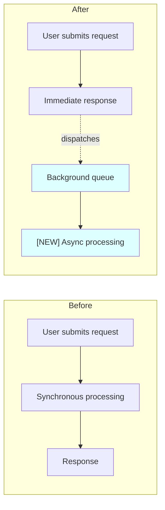

<!--
========================================================================
TEMPLATE: KNOWLEDGE.md
========================================================================
This file is a TEMPLATE. The skill renders it into the target repo's root.

Placeholders to fill ({{NAME}}):
  - {{REPO_SLUG}}          e.g. frnd-api-php
  - {{STACK}}              e.g. "Laravel 13 · PHP 8.4 · Sanctum/JWT · Reverb · ClickHouse"
  - {{DEFAULT_BRANCH}}     e.g. develop
  - {{SURFACE_AREA}}       paragraph of stack-specific path hints for §3 (from stack-profiles.md)
  - {{EXTERNAL_DEPS}}      comma list of external services repo calls (e.g. "Xendit, OpenAI, Pusher, ClickHouse")
  - {{STORAGE_BACKENDS}}   comma list of storage layers (e.g. "MySQL, ClickHouse, S3, Redis")
  - {{TESTING_POLICY}}     one-line caveat (e.g. "AGENTS.md forbids creating tests without explicit permission")

Strip this entire HTML-comment header before writing to the target repo.
========================================================================
-->
# KNOWLEDGE.md — PR Challenge & Architecture Impact ({{REPO_SLUG}})

> Companion to `REVIEW.md`. REVIEW asks *"is code correct, lean, safe?"*. KNOWLEDGE asks *"does change make sense given current system, can non-engineer understand what shifted?"*
> **Stack:** {{STACK}}
> **Default branch:** `{{DEFAULT_BRANCH}}`

## 1. Purpose

Two-phase analysis per PR: (1) **Map** — what affected feature does today, user/product level. (2) **Challenge** — what PR changes, improves, risks, what new concept introduced.

Output consumed by engineers + PMs/leadership (Lark group). Non-technical reader at top, technical depth below. Not judging code quality/style/security — `REVIEW.md` owns those. Job = feature-shape + architecture-shape.

## 2. Invocation Modes

Paired with Code Review (`REVIEW.md`) on same PR. Two root comments posted:

| Root comment | Source | Purpose |
|--------------|--------|---------|
| `## 🔍 Code Review` | `REVIEW.md` | Code-level findings, security, idiom. Inline on code. |
| `## 🧭 Feature Impact & Challenge` | `KNOWLEDGE.md` | High-level product/architecture shift. Diagram. No code-level detail. |

MUST be visually + titularly distinct. Never produce content belonging to other comment.

**Mode A** (PR/runner): one dedicated comment titled `## 🧭 Feature Impact & Challenge`. Full §6 markdown incl mermaid. No inline line-comments (REVIEW.md's job).

**Mode B** (ad-hoc): same §6 markdown to terminal. Mermaid renders inline in supporting agents, else copy-pastable.

Output structure identical when emitted — see §6. May skip per §2.5.

## 2.5 Skip Gate

Analysis (§3 + §4) runs **always**. Output comment optional — SKIP when no feature/architectural/significant shift worth surfacing.

**Skip when ALL true:**
- §4.1 user-visible change → none (rename, format, comment edit, dep bump no behaviour delta, test-only, doc-only, dead-code removal, log tweak).
- §4.2 system change → no new layer, no flow reroute, no sync↔async, no new external call, no broadcast/cache/queue topology change.
- §4.3 new concepts → none.
- §4.4 replaces/deprecates → nothing meaningful (or private symbol w/ 1 caller).
- §4.5 data/migration → none.
- §4.6 perf/cost → no new external call, no new queue load, no new broadcast, no cache invalidation change.
- §4.7 risks → none of substance (don't invent).

**Emit when ANY true:** user-describable change · future engineer needs to know new concept · data shape/migration/backfill involved · new external dependency or cost · architectural shape shifts (layer boundaries, sync/async, broadcast, cache, queue) · removes/deprecates capability.

When in doubt: **emit**. Gate is for obviously-trivial cases only.

**Skip output contract** (Mode A): single sentinel block to stdout instead of §6 template:

```
===SKIP===
reason: <one-sentence rationale — e.g. "{{STYLE_TOOL}} auto-formatting on 14 files; no behaviour change">
===END SKIP===
```

Runner detects sentinel, posts no Knowledge comment. Lark notification omits Knowledge section. Mode B prints same sentinel to terminal (signals analysis ran, gate fired — not silent failure).

**Always do analysis.** Build §3 (map) + walk §4 (challenge) internally even when skipping. Skip decision = output of analysis, not shortcut around it.

## 3. Phase 1 — Map

Build picture of what affected slice does *as of PR base branch*.

**Surface area to collect from diff:** {{SURFACE_AREA}}

**Questions map must answer** (use whichever tools available, read narrow not whole modules): what calls each changed entry-point/method · what each changed method calls downstream · blast radius of each affected file (imports, route registrations, provider bindings, config refs) · which execution flows pass through changed code end-to-end · where affected concept lives across codebase · high-level shape of touched module.

**Translate to product language.** For each touched feature, 1–3 sentence plain-English description of what it does for end user today. Avoid class/method/table names + framework jargon. Examples:
- "Brand owners configure tonality presets the AI generator uses as style anchors. Today, presets global per workspace, no per-campaign toggle."
- "When invoice settles, we credit workspace wallet, send receipt email, bump subscription renewal by one billing cycle."

**Note architectural shape** in bullets: which layers exist, which boundaries clean/not, where data flows, what's sync vs queued, what's broadcast real-time, what's cached, where stored ({{STORAGE_BACKENDS}}). Baseline for PR comparison.

## 4. Phase 2 — Challenge

Read diff with §3 map in hand. Produce findings under headings below. Skip heading with nothing genuine to say — do not fabricate.

**4.1 What changes for user.** Plain English. One paragraph max. If no user-visible change: *"No user-visible behaviour change — internal refactor of <subsystem>."*

**4.2 What changes for system.** Bullets, one per shift at layer that moved:
- "Credit deduction moves sync (in-request) → queued."
- "Tonality resolved per-campaign w/ fallback to workspace default."
- "New table introduced; existing daily rollup continues."

**4.3 New concepts.** Every concept not in base branch that future engineer must learn: name, one-sentence definition, where it lives.
> **CampaignTonalityResolver** — service picking tonality preset per campaign, walking campaign-override → workspace-default → org-default.

**4.4 Replaces/deprecates.** Anything PR makes redundant: file, class, method, route, table, env-var. Parallel implementation → call out + ask removal date.

**4.5 Data & migration impact.** New tables/columns/indexes? Which DB ({{STORAGE_BACKENDS}})? Backfill needed? In-PR or follow-up? Reversible? Locking risk on large tables? Existing query needs new index?

**4.6 Performance, cost, scaling.** New external API calls per request ({{EXTERNAL_DEPS}}) — cost × volume · new queue load (which queue, jobs/min, capacity headroom) · new broadcast traffic (channel scope, subscriber count) · cache invalidation pattern changes.

**4.7 Risks & open questions.** Bullets, one per risk author may not have considered. Question for thread, not accusation.

**4.8 What's good.** One bullet per design choice genuinely improving architecture — no cap. Skip if nothing to celebrate. No invented praise.

## 5. Diagram

Always one mermaid diagram. Kind that best shows shift:

| Diagram | When | Mermaid |
|---------|------|---------|
| Before/After flow | Behaviour or call-graph changed | `flowchart LR` w/ `subgraph Before`/`subgraph After` |
| Sequence | Async/queued/broadcast interaction changed | `sequenceDiagram` |
| ER | Schema or relations changed | `erDiagram` |
| State machine | Model gains/loses states or transitions | `stateDiagram-v2` |

Rules: must render in GitHub comments natively · ≤25 nodes (more → too big, slice most-impacted) · label edges with verbs (dispatches/publishes to/writes/reads from) · mark new nodes with `[NEW]` prefix or `style nodeName fill:#dff` · NO class/method names — product-level labels only.

Example:



## 6. Output Template

High-level concept review. Non-technical companion to `REVIEW.md`. Strip every code-level detail.

**Hard rules:** no file paths/class/method/table names in body (concept names in product language OK — "Campaign Tonality Resolver", never class behind it) · no duplication of `REVIEW.md` findings · no inline code blocks except mermaid · diagram mandatory unless skip gate fired · bullets uncapped, never truncate.

Omit sub-bullets when nothing to say but never omit section headings — write "_No change._".

```markdown
## 🧭 Feature Impact & Challenge

### 📋 TL;DR
<2–3 sentences a PM reads in 10 seconds. User impact + shape of shift.>

### 👤 What changes for the user
<1 short paragraph, plain English. If none: "_No user-visible change — internal-only shift._">

### 🔧 What changes for the system
- <bullet, product-layer language>
- <one bullet per distinct shift, no cap>

### 🗺 Diagram
```mermaid
<§5 diagram — before/after, sequence, ER, or state — pick what shows the shift best>
```

### 🆕 New concepts
- **<Concept name>** — <one-sentence definition>

(One bullet per concept, no cap. Skip section if none.)

### 💾 Data & migration impact
<One line. Examples: "_No schema change._" · "Adds new table for hourly rollups." · "Backfills 2.1M rows with default value.">

### 📈 Cost & scaling impact
<One line. Examples: "_None._" · "Adds 1 external API call per request." · "+30 jobs/min on default queue at peak.">

### ⚠️ Risks & open questions
- <high-level risk or question — product/architecture level, not code>

(One bullet per risk, no cap. Skip section if none.)

### ✨ What's good
<1 line — genuinely nice architectural choice. Skip section if nothing stands out; do NOT fabricate.>

---
_Source: `KNOWLEDGE.md` · For code-level findings, see the Code Review comment._
```

### Caveman compression (if skill available)

If `caveman` skill detected, render bullets + list items in caveman-full: drop articles, fragments OK, short synonyms. Descriptions (TL;DR, user-change paragraph, data/cost one-liners, footer) stay plain English. Concept names, mermaid diagram, section headings verbatim. Detection: (1) `caveman` in loaded skills, (2) `~/.claude/skills/caveman*`, (3) `.claude/skills/caveman*`. None → plain English.

## 7. Tone

- Whole comment for non-engineers first. Plain English, no class/method/file/table names in body. Concept names in product language only.
- Never restate diff line by line.
- Never speculate author intent. Ask in `⚠️ Risks & open questions` instead.
- One diagram only. If you want two → PR too broad, say so under Risks.
- Default to skip (§2.5). Most non-user-facing PRs shouldn't get Knowledge comment. Emit only when real story to tell.
- No overlap with REVIEW.md. Bug/vuln/style → do nothing, REVIEW owns it. No "worth a security pass" mentions.
- Code-level findings = silent. Zero inline line-comments. Only output = single root comment per §6 (or skip sentinel).

## 8. Execution Recipe

(1) runner has fetched `origin/<base>` + `origin/<pr-branch>` + diff in prompt. (2) build map (§3) first — no output until map exists. (3) read diff + produce §4 findings against map (runs unconditionally). (4) apply skip gate §2.5 — if all conditions hold, emit `===SKIP===` sentinel + rationale, exit. (5) else draft diagram §5. (6) emit §6 template as only output — runner posts verbatim as single PR comment first line `## 🧭 Feature Impact & Challenge` (distinct title mandatory). (7) exit `0` always — runner distinguishes skip vs emit by sentinel presence.

## 9. Out of Scope

Code correctness/style/security → `REVIEW.md`. Test plan → handled separately ({{TESTING_POLICY}}). Release/rollout planning → PR author + workflow's release phase.
